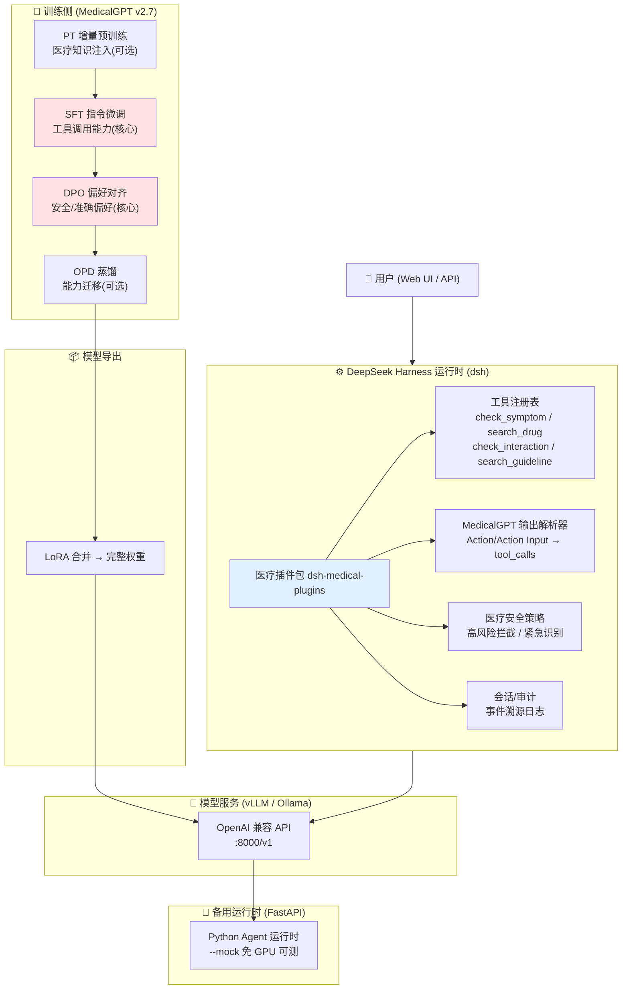
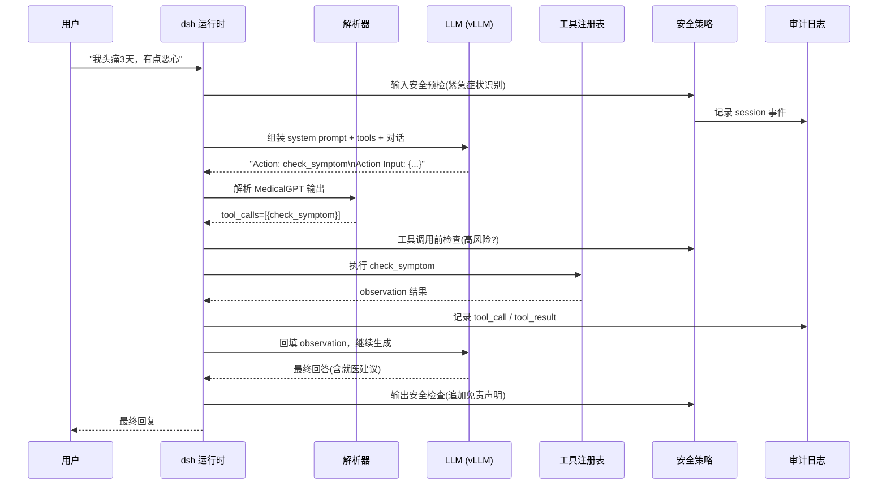

<div align="center">

# 🏥 Medical-GPT — 医疗大模型 Agent 系统

**基于 MedicalGPT 训练管线 + DeepSeek Harness 可插拔运行时构建的医疗大模型 Agent，支持症状分析、药品查询、临床指南检索等医疗工具调用，内置安全策略与合规审计。**

[](https://python.org/)
[](https://pytorch.org/)
[](https://github.com/shibing624/MedicalGPT)
[](https://github.com/deepseek-ai/deepseek-harness)
[](https://typescriptlang.org/)
[](https://fastapi.tiangolo.com/)
[](https://github.com/vllm-project/vllm)

</div>

---

## 📖 项目简介

Medical-GPT 是一个面向**医疗健康场景**的大模型 Agent 系统。它把 **MedicalGPT 训练管线**（增量预训练 → SFT 工具调用微调 → DPO 偏好对齐）产出的、具备医疗工具调用能力的模型，接入 **DeepSeek Harness（dsh）** 可插拔运行时，对外提供**症状分析、药品查询、药物相互作用检查、临床指南检索**等医疗工具能力，并内置**医疗安全策略、紧急症状识别、合规审计日志**。

### 核心架构理念

- **训练侧（MedicalGPT）**：用 ShareGPT 格式（含 `function_call` / `observation` 角色）训练模型的工具调用能力，用 DPO 对齐"主动调工具、安全准确回答"的偏好。
- **运行时侧（DeepSeek Harness）**：一切皆插件（Everything is a Plugin），医疗工具、输出解析器、安全策略、审计日志都以插件形式挂载，可热插拔、可替换。
- **安全合规**：高风险操作（诊断/处方）策略拦截，紧急症状自动建议就医/拨打 120，所有轨迹事件溯源审计。

### 适用场景

- **智能导诊**：用户描述症状，Agent 调用症状分析工具，给出可能的病因与就医建议
- **用药咨询**：药品适应症/禁忌症/用法用量/副作用查询，多药相互作用检查
- **健康科普**：基于临床指南的疾病管理建议（饮食、运动、用药等）
- **Agent 架构实践**：涵盖 LLM 工具调用训练、可插拔运行时、安全策略、审计溯源等完整链路

**一句话总结**：不只是训练一个医疗模型，更是一套"训练 → 部署 → 安全合规"的医疗 Agent 完整工程实践。

---

## 🏗️ 系统架构



### Agent 工具调用时序



---

## ✨ 核心亮点

### 亮点一：工具调用能力的训练闭环

采用 MedicalGPT ShareGPT 格式，通过 `function_call` / `observation` 两种角色显式训练"模型何时调用工具、如何构造参数、如何基于观察结果作答"，而非仅靠 prompt 工程。相比普通 SFT，`--tool_format default` + 更大的 `--lora_rank 16` 显著提升工具选择与参数提取准确率。

### 亮点二：一切皆插件的可插拔运行时

基于 DeepSeek Harness（Cordis「一切皆插件」架构），医疗工具、输出解析器、安全策略、审计日志全部以插件形式注册，可热插拔、可替换。同一套模型权重可接入 dsh 的 `web` / `headless` / `sdk` 等多种 profile。

### 亮点三：医疗安全策略 + 合规审计

- **高风险工具拦截**：诊断/处方/转诊等操作不直接执行，返回"需执业医师确认"提示
- **紧急症状识别**：呼吸困难、胸痛、昏迷等关键词触发，自动建议拨打 120
- **输出免责声明**：自动追加"建议就医，不能替代专业诊断"
- **事件溯源**：完整记录会话轨迹（输入 → 工具调用 → 工具结果 → 输出）到审计日志

### 亮点四：双运行时保障

除 DeepSeek Harness 插件外，提供等价的 **Python FastAPI 运行时**（`--mock` 模式免 GPU 即可端到端验证），便于在无 GPU / 无 Node 环境下快速联调与 CI 测试。

---

## 🔧 关键问题解决方案

### 1. 医疗场景的幻觉抑制

- 训练侧：DPO 数据中 `rejected` 样本为"直接凭记忆回答"，`chosen` 为"先调工具再回答"，对齐"优先查工具、不瞎编"的偏好
- 推理侧：`temperature=0.3` 低温度采样；system prompt 强制"药品信息必须查询工具获取"

### 2. 工具调用格式的稳定解析

MedicalGPT 输出 `Action: tool_name\nAction Input: {...}` 格式，解析器用正则 + 容错降级（JSON 解析失败降级为普通文本），保证鲁棒。

### 3. 医疗安全边界

系统不做诊断与处方（这是法律红线），而是通过策略层强制"建议就医"，把高风险动作拦截在工具执行之前。

### 4. 运行时 API 的漂移风险

DeepSeek Harness 处于 developer preview（存在 breaking change），本项目同时提供 Python 运行时作为稳定 fallback，并在文档中标注 dsh 版本依赖。

---

## 🛠️ 技术栈

### 训练侧
| 组件 | 技术 | 说明 |
|------|------|------|
| 训练框架 | MedicalGPT v2.7 | PT/SFT/DPO/OPD 全管线 |
| 基座模型 | Qwen2.5-7B-Instruct | 中文强、原生支持工具调用 |
| 微调 | LoRA (PEFT) | rank 8~16，显存友好 |
| 分布式 | DeepSpeed / Accelerate | 可选 |

### 运行时侧
| 组件 | 技术 | 说明 |
|------|------|------|
| 插件框架 | DeepSeek Harness (Cordis) | 一切皆插件 |
| 模型服务 | vLLM / Ollama | OpenAI 兼容 API |
| 备用运行时 | Python FastAPI | --mock 免 GPU 测试 |
| 审计 | JSONL 事件溯源 | 合规审计 |

---

## 🚀 快速开始

> 完整细节见 [部署文档](docs/deployment.md)，训练细节见 [训练文档](docs/training.md)。

### 阶段 A：训练（需 GPU，建议 AutoDL 3090/4090）

```bash
# 1. 克隆项目与 MedicalGPT
git clone <本仓库> && cd Medical
git clone https://github.com/shibing624/MedicalGPT.git

# 2. 建环境
conda create -n medgpt python=3.10 -y && conda activate medgpt
cd MedicalGPT && pip install -r requirements.txt && cd ..

# 3. 校验/生成数据
cd training/scripts
python validate_data.py --dir ../data/sft
python validate_data.py --dir ../data/reward
# （可选）重新下载/扩充数据
# HF_ENDPOINT=https://hf-mirror.com python download_real_data.py --out ../data/sft/_raw_medical_qa.jsonl
# DEEPSEEK_API_KEY=sk-xxx python build_toolcall_data.py --mode both --model deepseek-chat

# 4. 训练（按需执行）
bash run_sft.sh          # 核心：工具调用 SFT
bash run_dpo.sh          # 核心：偏好对齐
bash merge_lora.sh       # 合并 LoRA 导出完整权重
```

### 阶段 B：部署（运行时）

```bash
# 方式一：Python FastAPI 运行时（免 GPU 可用 --mock）
cd runtime/server
pip install -r requirements.txt
python main.py --backend mock                    # 无 GPU 联调
python main.py --backend vllm --base-url http://localhost:8000/v1 --model medical-agent   # 接 vLLM

# 方式二：DeepSeek Harness
cd runtime/dsh-medical-plugins && npm install && npm run build
npx @deepseek-ai/dsh web   # 打开 http://127.0.0.1:3080
```

---

## 📁 项目结构

```
Medical/
├── README.md                        # 本文件
├── .gitignore
├── docs/
│   ├── architecture.md              # 架构文档（数据流/组件交互/设计决策）
│   ├── training.md                  # 训练文档（实录 + 22 个踩坑 + 评估结果 + 方法论）
│   └── deployment.md                # 部署文档（环境/启动/API 文档）
├── training/                        # 训练侧
│   ├── data/
│   │   ├── pretrain/                # PT 数据（可选）
│   │   ├── sft/                     # SFT 数据（必须）
│   │   │   ├── medical_qa.jsonl
│   │   │   ├── toolcall_symptom.jsonl
│   │   │   ├── toolcall_drug.jsonl
│   │   │   ├── toolcall_guideline.jsonl
│   │   │   ├── all_sft.jsonl        # 合并后的 SFT 数据（4945 条）
│   │   │   └── eval_sft.jsonl       # SFT 验证集
│   │   ├── reward/                  # DPO 数据（必须）
│   │   │   ├── medical_dpo.jsonl
│   │   │   ├── toolcall_dpo.jsonl
│   │   │   └── eval_dpo.jsonl       # DPO 验证集
│   │   ├── opd/                     # OPD 蒸馏数据（精选 1500 条）
│   │   │   ├── opd_data.jsonl
│   │   │   └── eval_opd.jsonl       # OPD 验证集
│   │   └── raw_medical_qa.jsonl     # 原始医疗问答
│   ├── scripts/
│   │   ├── sft_train.sh             # SFT 训练脚本（实际）
│   │   ├── dpo_train.sh             # DPO 训练脚本（实际）
│   │   ├── opd_train.sh             # OPD 蒸馏脚本（实际）
│   │   ├── run_pt.sh / run_sft.sh / run_dpo.sh / run_opd.sh
│   │   ├── merge_lora.sh            # LoRA 合并导出
│   │   ├── build_toolcall_data.py   # 工具调用数据生成
│   │   ├── build_dpo_data.py        # DPO 数据生成
│   │   ├── build_opd_data.py        # OPD 数据生成
│   │   ├── build_sft_eval_data.py   # SFT eval 生成
│   │   ├── build_eval_data.py       # DPO/OPD eval 生成
│   │   ├── download_real_data.py    # HF 数据下载
│   │   ├── gen_seed_data.py         # 强模型生成种子数据
│   │   └── validate_data.py         # 数据格式校验
│   ├── logs/                        # 训练日志
│   │   ├── sft_train.log
│   │   ├── dpo_train.log
│   │   └── opd_train.log
│   ├── outputs/                     # 各阶段 LoRA adapter
│   │   ├── sft-qwen2.5-7b-agent/
│   │   ├── dpo-qwen2.5-7b-agent/
│   │   └── opd-qwen2.5-7b-agent/
│   └── requirements.txt
├── runtime/
│   ├── server/                      # Python FastAPI 运行时（备用/联调）
│   └── dsh-medical-plugins/         # DeepSeek Harness 插件（TypeScript/Cordis）
├── models/                          # 训练产出模型权重（.gitignore）
│   └── medical-agent-opd.tar.gz     # 最终合并模型（12G，压缩包）
└── logs/                            # 审计日志
    └── audit.jsonl
```

---

## 📚 相关文档

| 文档 | 说明 |
|------|------|
| [架构文档](docs/architecture.md) | 数据流图、组件交互图、关键设计决策 |
| [训练文档](docs/training.md) | 训练实录（步骤 + 22 个踩坑 + 评估结果）+ 通用方法论 |
| [部署文档](docs/deployment.md) | 环境要求、启动步骤、API 文档 |

---

## 📄 License & 免责声明

- 本项目代码采用 MIT License
- 本系统提供的所有信息仅供健康科普参考，**不构成医疗诊断、治疗建议或处方依据**。如遇身体不适，请及时前往正规医疗机构就诊；紧急情况请拨打 120。

## 致谢

- [MedicalGPT](https://github.com/shibing624/MedicalGPT) — 训练医疗大模型的完整管线
- [DeepSeek Harness](https://github.com/deepseek-ai/deepseek-harness) — 一切皆插件的 Agent 运行时
- [Qwen](https://github.com/QwenLM/Qwen2.5) — 基座模型
