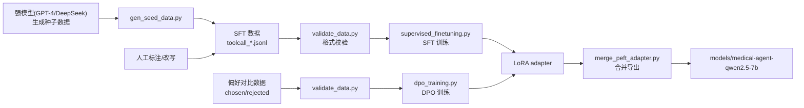
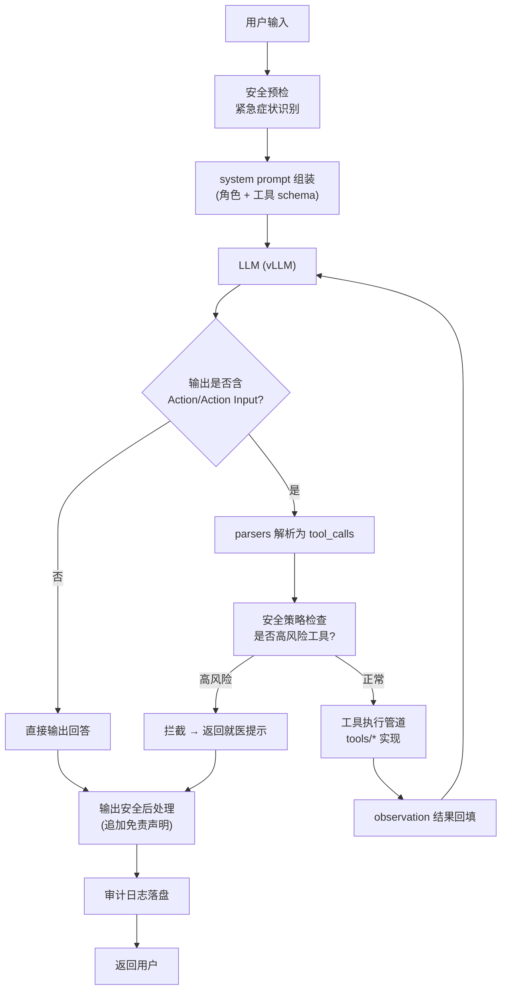

# 架构文档

本文档描述 Medical-GPT 医疗大模型 Agent 的整体架构、数据流、组件交互与关键设计决策。

## 1. 总体架构

系统分为**训练侧**与**运行时侧**两个阶段，通过"模型权重导出"衔接。

```
┌──────────────────────────────────────────────────────────────────────────┐
│                            训练侧 (MedicalGPT)                            │
│                                                                          │
│   PT 增量预训练 ──► SFT 工具调用微调 ──► DPO 偏好对齐 ──► OPD 蒸馏(可选)  │
│   (医疗知识注入)    (工具调用能力·核心)   (安全/准确偏好·核心)  (能力迁移)  │
└──────────────────────────────────────────────────────────────────────────┘
                                      │
                                      ▼  合并 LoRA → 完整权重
┌──────────────────────────────────────────────────────────────────────────┐
│                          运行时侧 (DeepSeek Harness)                      │
│                                                                          │
│   vLLM/Ollama 模型服务 ──► dsh 插件注册表 ──► 医疗工具执行管道             │
│   (OpenAI 兼容 API)       (Cordis 可逆插件)    (药品/症状/指南)            │
│                                      │                                    │
│                             会话/审计事件溯源日志                          │
└──────────────────────────────────────────────────────────────────────────┘
```

## 2. 数据流图

### 2.1 训练数据流



### 2.2 推理数据流（一次 Agent 往返）



## 3. 组件交互

### 3.1 训练侧组件

| 组件 | 输入 | 输出 | 职责 |
|------|------|------|------|
| `pretraining.py` | 医疗纯文本 jsonl | PT LoRA | 注入医疗领域知识（可选） |
| `supervised_finetuning.py` | ShareGPT 格式 sft 数据 | SFT LoRA | 学习工具调用与医疗问答 |
| `dpo_training.py` | chosen/rejected 偏好对 | DPO LoRA | 对齐"调工具/安全回答"偏好 |
| `opd_training.py` | 教师模型 + sft 数据 | OPD LoRA | 从强模型蒸馏能力（可选） |
| `merge_peft_adapter.py` | base + LoRA | 完整权重 | 合并导出可部署模型 |

### 3.2 运行时侧组件

| 组件 | 关键接口 | 职责 |
|------|---------|------|
| `llm.py` | `chat(messages, tools)` | 封装 vllm/ollama/mock 三种后端 |
| `parsers.py` | `parse_medicalgpt_output()` | Action/Action Input → tool_calls |
| `tools/` | `check_symptom` `search_drug` `check_interaction` `search_guideline` | 医疗工具实现 |
| `safety.py` | `before_tool_call` `before_process` `after_response` | 三道安全关卡 |
| `audit.py` | `log_event()` | JSONL 事件溯源 |
| `agent.py` | `run()` | Agent 主循环（编排以上组件） |

## 4. 关键设计决策

### 4.1 为什么用 ShareGPT 的 function_call/observation 格式训练

工具调用能力不能仅靠 system prompt 注入，而要让模型在训练阶段就见过"调用工具 → 接收观察 → 继续作答"的完整序列。MedicalGPT 在 ShareGPT 基础上扩展了 `function_call` 与 `observation` 两种角色，显式建模工具调用轨迹，比 ReAct prompt 模板更稳定。

### 4.2 为什么 DPO 数据"工具调用场景占 70%"

医疗场景的核心价值在于"查准"而非"能说"。因此偏好对齐时，`chosen` 样本强调"先调工具获取准确信息再回答"，`rejected` 样本为"直接凭参数记忆作答（可能过时/不准确）"，使模型倾向于保守地调用工具。

### 4.3 为什么工具调用 SFT 用更大的 LoRA rank（16）

工具描述 schema 与工具调用格式相对复杂，需要更大的低秩空间容纳新能力。常规 SFT 用 rank 8 即可，工具调用场景提升到 16 以换取更好的参数提取能力。

### 4.4 为什么采用低温度（temperature=0.3）

医疗场景对准确性要求极高、对多样性要求低。低温度采样能显著降低幻觉与格式漂移（例如工具名拼错、JSON 参数非法）。

### 4.5 为什么设计三道安全关卡而非单一过滤

- **输入关卡（before_process）**：紧急症状（胸痛、呼吸困难、昏迷等）立即注入"拨打 120"系统提示，把安全信息前置。
- **工具关卡（before_tool_call）**：高风险工具（诊断/处方/转诊）在**执行前**拦截，避免产生不可逆的误导。
- **输出关卡（after_response）**：兜底追加免责声明，覆盖所有未被前两关拦截的输出。

### 4.6 为什么提供 Python 运行时作为 fallback

DeepSeek Harness 处于 developer preview，API 存在 breaking change。为保证项目在任意环境可复现、可 CI 测试，提供等价的 FastAPI 实现，`--mock` 模式免 GPU 即可端到端验证完整链路。

## 5. 扩展点

- **接入真实医学知识图谱**：将 `tools/symptom.py` 的规则引擎替换为 CMeKG / OpenKG 的图谱查询 API。
- **接入真实药品库**：将 `tools/drug.py` 的内存 Map 替换为药典数据库（如国家药监局数据）。
- **多模型后端**：`llm.py` 已抽象后端，可扩展至 OpenAI / 通义 / 本地 GGUF 等任意 OpenAI 兼容服务。
- **新增工具**：在 `tools/` 新增实现，并在 `agent.py` 的 `TOOLS` 注册表中登记即可，训练时同步扩展 SFT 数据。
